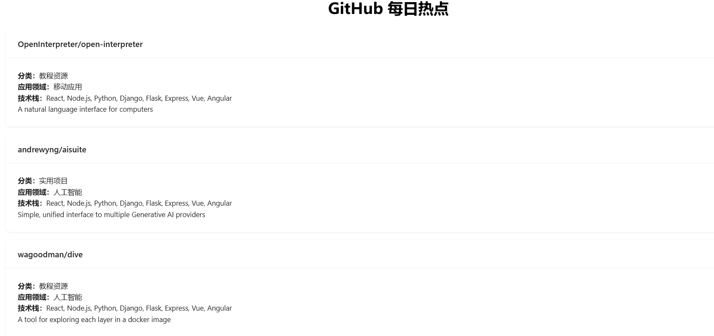

# GitHub 每日热点

GitHub 每日热点是一个展示 GitHub 当日热门仓库的网站。通过此平台，用户可以轻松浏览当前最受关注的开源项目，了解其分类、应用领域、技术栈及简介。

## 目录

- [GitHub 每日热点](#github-每日热点)
  - [目录](#目录)
  - [演示](#演示)
  - [特性](#特性)
  - [技术栈](#技术栈)
    - [前端](#前端)
    - [后端](#后端)
  - [项目结构](#项目结构)
  - [安装与运行](#安装与运行)
    - [前提条件](#前提条件)
    - [后端](#后端-1)
    - [前端](#前端-1)
    - [运行](#运行)

## 演示




## 特性

- **实时更新**：每日抓取 GitHub Trending 页面，展示最新的热门仓库。
- **详细信息**：每个仓库包含名称、分类、应用领域、技术栈及简介。
- **响应式设计**：适配多种设备，提供良好的用户体验。
- **简洁美观**：采用 Ant Design 和 Tailwind CSS 进行页面美化。

## 技术栈

### 前端

- **React**：构建用户界面的 JavaScript 库。
- **Tailwind CSS**：实用优先的 CSS 框架，用于快速设计。
- **Ant Design**：企业级 UI 设计语言和 React 组件库。
- **Axios**：基于 Promise 的 HTTP 客户端，用于与后端 API 通信。

### 后端

- **Node.js**：基于 Chrome V8 引擎的 JavaScript 运行环境。
- **Express.js**：灵活的 Node.js Web 应用框架。
- **Axios**：用于抓取 GitHub Trending 页面的 HTTP 客户端。
- **Cheerio**：快速、灵活、精简的 jQuery 核心实现，用于服务器端操作 HTML。
- **Cors**：用于启用跨域资源共享。

## 项目结构

github-trending-site/
├── backend/
│ ├── package.json
│ ├── server.js
│ ├── routes/
│ │ └── trending.js
│ └── utils/
│ └── fetchTrending.js
├── frontend/
│ ├── package.json
│ ├── public/
│ │ └── index.html
│ └── src/
│ ├── App.js
│ ├── index.js
│ ├── components/
│ │ └── RepositoryCard.jsx
│ └── styles/
│ └── tailwind.css
└── README.md

## 安装与运行

### 前提条件

确保您的系统已安装以下软件：

- [Node.js](https://nodejs.org/) (版本 >= 14.x)
- [npm](https://www.npmjs.com/) 或 [Yarn](https://yarnpkg.com/)

### 后端

1. **导航到 `backend` 文件夹**

```bash
   cd backend
   npm install
```

2. **安装依赖**

```bash
npm install
```

3. **启动后端服务器**

```bash
npm run dev
```

### 前端

1. **导航到 frontend 文件夹**

```bash
cd frontend
```

2. **安装依赖**

```bash
npm install
```

3. **启动前端应用**

```bash
npm start
```

### 运行

访问 http://localhost:3000

